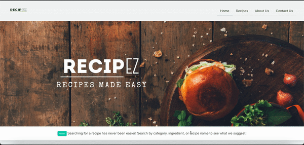

<h1 align="center">RecipEZ<h1>

<h2 align="center">Forget the annoying fluff, all you need is the good stuff.</h2>
 

  <h4>
    <a href="#description">
      Description
    </a>
     | 
    <a href="#usage">
      Usage
    </a>
     | 
    <a href="#built-with">
      Built With
    </a>
    |
    <a href="#url">
      Website URL
    </a>
    |
    <a href="#mock-up">
      Mock Up
    </a>
    |
    <a href="#contributors">
      Contributors
    </a>
  </h4>

 

<h3 id="description" align="center">Description</h3>

An application that allows users to search for a recipe based on a recipe or a drink. Using two APIs: <a href="https://spoonacular.com/food-api">Spoontacular API</a> and <a href="https://www.thecocktaildb.com/">The Cocktail DB</a>, we created an application that allows users to search for a detailed recipe based on the search parameters of recipe or drink.

We were tired of the same argument of what to eat or drink so we decided to come up with this application that solves all of those issues. Easily search for a recipe that gives detailed information without unnecessary rambling that most recipe blogs have.

 

<h3 id="usage" align="center">Usage</h3>

Recipe libary that uses APIs to connect users with a large amount of recipes. Simply search for a recipe in the input field and you will be taken to the linked recipe.

 

<h3 id="built-with">Built With</h3>
<ul>
<li>HTML</li>
<li>CSS</li>
<li>JavaScript</li>
<li>jQuery</li>
<li><a href="https://bulma.io/">Bulma</a></li>
</ul>
 

<h3 id="url">Website URL</h3>
<a href="https://amir-hackett.github.io/RecipEZ/">Deployed Application</a>
  

<h3 id="contributors">Contributors</h3>
<ul>
<li><a href="https://github.com/cobalt88">Vincent Teune</a></li>
<li><a href="https://github.com/Amir-Hackett">Amir Hackett</a></li>
<li><a href="https://github.com/JamieSteinbauer">Jamie Steinbauer</a></li>
</ul>

<h3 id="mock-up">Mock Up</h3>

The following animation demonstrates the application functionality:

